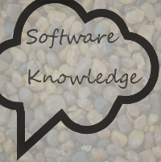

<h1 align="center">
 
  
   
     
  接触到的开发的一些概念
   
</h1>

## 简介

这个项目是为了帮助自己掌握 软体开发 概念而创立的。它不是必备，但在未来学习中，可以作为一篇指南。

---

## 目录

1. :book: [JS传送门 JavaScriptPortal](https://github.com/gui-sukla/JavaScriptPortal/blob/master/README.md)
2. :book: [EXT传送门 EXTPortal](https://github.com/gui-sukla/EXTPortal/blob/master/README.md)

---

